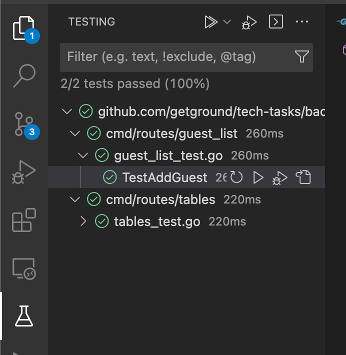

# GetGround End Year Party Service

> Alberto Xamin 2023

> Note please use the revised postman, as the ID are capitalized and some return statuses didn't match

## Development Setup

To get you started, first of all start your development db instance.

You can do it with `docker-compose up -d`, the go container is still commented out for now.

Once your db is up, you can start the app with `go run cmd/main.go`

## Project Overview

in the current implementation, the logic for starting the HTTP server and registering the controllers for handling different routes is contained in the `main.go` file located in the `cmd` directory. The `common` directory contains shared code that is used throughout the application, such as database connection management and data models. The routes directory contains individual controllers for each set of routes, such as the `guest_list` controller or the `tables` controller. This is a common way to organize a Go application and it makes the code more maintainable by keeping the main package clean, separating concerns, and allowing for easy modification and addition of new controllers.

```
cmd
├── common
│   ├── db
│   └── models
└── routes
    ├── guest_list
    ├── guests
    ├── seats_empty
    └── tables
```

### Adding new endpoints

1. Create a new folder under routes and create a `controller.go` file
2. Create the implementation of the business logic in separate files in that folder
3. register your endpoint inside `main.go`

### Adding new Models

1. Create a new file under the models directory
2. Register your newly created model in `common/db/db.go`, in a similar format `db.AutoMigrate(&models.MyNewModel{})`

## Testing

> I implemented some tests to give an idea how testing could be expanded

If it's your first time running tests on this repo, you will need to create a new testing db on your container.
You can do that by running this command in your terminal
```sh
mysql -u root --password=password --protocol=TCP -e "create database test"
```

once your database is set up you will be able to run the tests from your ide.



If you don't fancy ide help you can also execute the tests from the terminal, for example you can test the AddGuest logic here

```sh
go test -timeout 30s -run ^TestAddGuest$ github.com/getground/tech-tasks/backend/cmd/routes/guest_list
```

## Improvements

First of all this current implementation was following the directions of the assignment, and in the definition it wasn't following a RESTful approach which could make the api grow more confusing as more endpoints are added.

A proposal of a RESTful api that achieves the same functionality 

A more RESTful design for the API could be:


```
POST /tables
body: 
{
    "capacity": 10
}
response: 
{
    "id": 2,
    "capacity": 10
}
```


```
POST /tables/{tableId}/guests
body: 
{
    "name": "string",
    "accompanying_guests": int
}
response: 
{
    "name": "string"
}
```


```
GET /tables/{tableId}/guests
response: 
{
    "guests": [
        {
            "name": "string",
            "accompanying_guests": int
        }, ...
    ]
}
```


```
PUT /tables/{tableId}/guests/{name}
body:
{
    "accompanying_guests": int,
    "time_arrived": "string"
}
response:
{
    "name": "string"
}
```


```
DELETE /tables/{tableId}/guests/{name}
response code: 204
```


```
GET /tables/{tableId}/guests/arrived
response: 
{
    "guests": [
        {
            "name": "string",
            "accompanying_guests": int,
            "time_arrived": "string"
        }
    ]
}
```

```
GET /seats_empty
response:
{
    "seats_empty": int
}
```

This design follows RESTful principles, using proper HTTP methods, providing consistent and semantic URLs, and using proper HTTP status codes. Additionally, it makes use of resources like tables and guests, which can be identified by unique identifiers like tableId and name, and allows to actions such as add guests and updating guests.